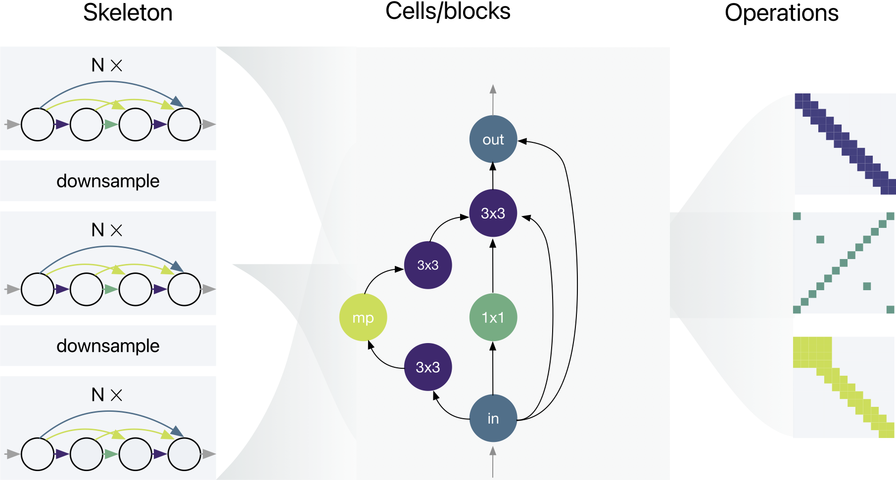
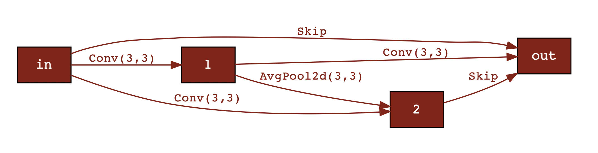

<p align="center">
  <!-- license -->
  <a href="https://tldrlegal.com/license/apache-license-2.0-%28apache-2.0%29">
      
  </a>
  <!-- pypi version --> 
  <a href="https://pypi.org/project/gymnastics/">
    
  </a>
  <!-- CI status -->
  <a href="">
    
  </a>
  <!-- Code analysis -->
  
</p>

<p align="center">
  <i>A "gym" style toolkit for building lightweight Neural Architecture Search systems. I know, the name is awful. </i>
</p>

## Installation 

**Preferred option:** Install from source: 
```
git clone git@github.com:jack-willturner/gymnastics.git
cd gymnastics
python setup.py install
```

To install the latest release version:
```bash
pip install gymnastics
```

If you want to use NAS-Bench-101, follow the instructions [here](https://github.com/google-research/nasbench) to get it set up.

## Overview

Over the course of the final year of my PhD I worked a lot on Neural Architecture Search (NAS) and built a bunch of tooling to make my life easier. This is an effort to standardise the various features into a single framework and provide a "gym" style toolkit for comparing various algorithms.

The key use cases for this library are:
- test out new predictors on various NAS benchmarks 
- visualise the cells/graphs of your architectures
- add new operations to NAS spaces 
- add new backbones to NAS spaces

The framework revolves around three key classes:
1. `Model` 
2. `Proxy`
3. `SearchSpace`

### The anatomy of NAS



We can break down NAS spaces into three separate components: the skeleton or backbone of the network, the possible cells that can fill the skeletons, and the possible operations that can fill the cells. NAS papers and benchmarks all define their own versions of each of these variables. Our goal here is to de-couple the "search strategy" from the "search space" by allowing NAS designers to test out their technique on many NAS search spaces very easily. Specifically, the goal is the provide an easy interface for defining each column of the picture above.


### Obligatory builder pattern README example

Using `gymnastics` we can very easily reconstruct NAS spaces (the goal being that it's easy to define new and exciting ones).

For example, here's how easy it is to redefine the NATS-Bench / NAS-Bench-201 search space:

```python
from gymnastics.searchspace import SearchSpace, CellSpace, Skeleton
from gymnastics.searchspace.ops import Conv3x3, Conv1x1, AvgPool2d, Skip, Zeroize

search_space = SearchSpace(
    CellSpace(
        ops=[Conv3x3, Conv1x1, AvgPool2d, Skip, Zeroize], num_nodes=4, num_edges=6
    ),
    Skeleton(
        style=ResNetCIFAR,
        num_blocks=[5, 5, 5],
        channels_per_stage=[16, 32, 64],
        strides_per_stage=[1, 2, 2],
        block_expansion=1
    ),
)


# create an accuracy predictor
from gymnastics.proxies import NASWOT
from gymnastics.datasets import CIFAR10Loader

proxy = NASWOT()
dataset = CIFAR10Loader(path="~/datasets/cifar10", download=False)

minibatch, _ = dataset.sample_minibatch()

best_score = 0.0
best_model = None

# try out 10 random architectures and save the best one
for i in range(10):

    model = search_space.sample_random_architecture()

    y = model(minibatch)

    score = proxy.score(model, minibatch)

    if score > best_score:
        best_score = score
        best_model = model

best_model.show_picture()
```

Which prints:



Have a look in `examples/` for more examples.

### NAS-Benchmarks 

If you have designed a new proxy for accuracy and want to test its performance, you can use the benchmarks available in `benchmarks/`.  

The interface to the benchmarks is exactly the same as the above example for `SearchSpace`.

For example, here we score networks from the NDS ResNet space using random input data:

```python
import torch
from gymnastics.benchmarks import NDSSearchSpace
from gymnastics.proxies import Proxy, NASWOT

search_space = NDSSearchSpace(
    "~/nds/data/ResNet.json", searchspace="ResNet"
)

proxy: Proxy = NASWOT()
minibatch: torch.Tensor = torch.rand((10, 3, 32, 32))

scores = []

for _ in range(10):
    model = search_space.sample_random_architecture()
    scores.append(proxy.score(model, minibatch))
```

## Additional supported operations

In addition to the standard NAS operations we include a few more exotic ones, all in various states of completion:

| Op                  | Paper                                         | Notes                                                               |
| ------------------- | --------------------------------------------- | ------------------------------------------------------------------- |
| conv                | -                                             | params: kernel size                                                 |
| gconv               | -                                             | + params: group                                                     |
| depthwise separable | [pdf](https://arxiv.org/pdf/1610.02357v3.pdf) | + no extra params needed                                            |
| mixconv             | [pdf](https://arxiv.org/pdf/1907.09595.pdf)   | + params: needs a list of kernel_sizes                              |
| octaveconv          | [pdf](https://arxiv.org/pdf/1904.05049.pdf)   | Don't have a sensible way to include this as a single operation yet |
| shift               | [pdf](https://arxiv.org/pdf/1711.08141.pdf)   | no params needed                                                    |
| ViT                 | [pdf](https://arxiv.org/pdf/2010.11929.pdf)   |                                                                     |
| Fused-MBConv        | [pdf](https://arxiv.org/pdf/2104.00298.pdf)   |                                                                     |
| Lambda              | [pdf](https://arxiv.org/pdf/2102.08602.pdf)   |                                                                     |

## Repositories that use this framework

- [NASWOT](https://github.com/jack-willturner/naswot)

## Alternatives

If you are looking for alternatives to this library, there are a few which I will try to keep a list of here:
- [NASzilla](https://github.com/naszilla/naszilla)
- [NASlib](https://github.com/automl/NASLib)
- [AutoDL](https://github.com/D-X-Y/AutoDL-Projects)
- [AutoPyTorch](https://github.com/automl/Auto-PyTorch)
